 

# Automated RGEE scripts to analyze the date of snowmelt, and timeseries of NDSI, NDVI and NDMI based on MODIS or Sentinel-2 satellite data.
All scripts in this Github respository rely on the R-package RGEE by Cesar Aybar et al. (https://github.com/r-spatial/rgee). These 
scripts provide an automated workflow to extract the timing of snowmelt at the level of pixels, points, subareas, or larger polygons 
based on either MODIS or Sentinel-2 satellite data. While the user can specify the required parameters (resolution, spatial extent, 
date ranges, cloud/water filtering etc) the rest of the script is automated and generates the required output data. In this ReadMe 
file you can find (I) Usage notes, (II) Which script to use?, and (III) Detailed description of RGEE scripts.

Copyright: Tom S.L. Versluijs 2023 (tom.versluijs@gmail.com)

When using any of these scripts for scientific publications, please cite the original Github repository by following the provided
information in the file 'CITATION.cff' found in the root folder of this Github respository.
 
 

#######################################################################################

# (I) USAGE NOTES

#######################################################################################

-(1) Make sure to download the complete github folder 'RGEE_Snowmelt' to make sure all dependencies between input files, scripts and output folders function properly. The complete repository can be
     cloned to your own Github repository using '<>Code/Clone', or to your local drive using '<>Code/Download ZIP'. IMPORTANT: make sure that you place the folder on a directory to which you have 
	 admin rights.
	 
-(2) Update to the newest versions of R and R-Studio before running the scripts. The scripts were developed with R-version 4.3.2 and R-Studio 2023.12.1 build 402.

-(3) If RGEE has not yet been installed, or does not function properly, make sure to install RGEE and its python dependencies using the script "00-RGEE_TomVersluijs_Installation.R". Note that
     getting RGEE to function properly can be quite a frustrating first hurdle to take. Things will get easier once everything is up and running!
	 
-(4) It is recommended to use the library() and p_load() functions in each script to install the newest versions of all required R-packages and their dependencies.	However, if this results in 
     an error, then the latest versions of R-packages (including dependencies) that were used to succesfully run the scripts are stored in the file "renv.lock". These specific versions can be 
	 downloaded and installed by running renv::restore() at the beginning of each script.	  
	 
-(5) All scripts in this Github folder need to be run from within the R-project "RGEE_Snowmelt.Rproj" in the root directory. Thus, first open the 'RGEE_Snowmelt.Rproj' file in RStudio, and then
     select the required script under 'Files/RGEE/R-scripts', or "/File/Open file..."
	 
-(6) All scripts rely on auxiliary scripts in the /RGEE/Input folder that specify commonly used functions. These auxiliary scripts are automatically sourced at the beginning of all main scripts. 

-(7) Several scripts rely on a shapefile of the study area as input. To construct these shapefiles follow the QGIS manual "Manual_QGIS_CreateShapefilePolygons" found in /RGEE/Manuals. After 
     creating your own shapefile(s), place them in the /RGEE/Input/Shapefiles directory.
	 
-(8) Each script generates its own output folder in the /RGEE/Output folder in the root directory.

-(9) All scripts are completely automated and require the user to only alter parameters in the "#Specify parameters of interest" section at the start of each script. After adjusting these 
     parameters the complete code can be selected (CTRL-A) and can be run at once (CTRL + ENTER, or CTRL + R, or by clicking Run in R-Studio).
	 
-(10) Sentinel-2 scripts can be computationally demanding and depending on the occupancy of the Google Earth Engine servers might take up to 16 hours to complete! The servers can sometimes be
     so busy that the script returns a 'computation time out' or 'computation error'. If this happens, please try to run the script again at some other time. If the code still results in an
	 computation error then your spatial extend is probably to large for the specified resolution. Either decrease the spatial resolution of the analysis by setting the parameter 'resolution',
	 or reduce the spatial extent of the analysis.
	 
-(11) For questions regarding potential errors and bugs please contact tom.versluijs@gmail.com.
 
 

#######################################################################################

# (II) WHICH SCRIPT TO USE?

#######################################################################################

For a more thorough description of all RGEE scripts, see the section 'DETAILED DESCRIPTION OF RGEE SCRIPTS' below.

### General comparison of MODIS and Sentinel-2
The R-scripts provided below analyze data using either MODIS or Sentinel-2 satellite data. The choice between either satellite depends
mostly on the required spatial resolution (MODIS=500m, sentinel-2=10m), and how far back in time you want to analyze these data
(MODIS since 2000, Sentinel-2 since 2016). Moreover, if you aim to analyze very large spatial extents (>50-200km2) then Sentinel-2
scripts often result in a computation error (even when manually specifying a lower spatial resolution). In that case MODIS data
is a better choice. Below, you can find a few queries to aid in picking the right script for your research question.

### Which years do you want to analyse?
* MODIS: 	 	
	* years: 2000 - current
	* scripts: 01 - 03

* Sentinel-2: 	
	* years: 2016 - current
	* scripts: 04 - 09

### What is the required spatial resolution of your analysis?
* MODIS: 	 	
	* resolution: 500 meter			
	* scripts: 01 - 03

* Sentinel-2:  	
	* resolution: 20 meter
	* scripts: 04 - 09

### MODIS scripts: what kind of data do you want to analyse?
* Date of snowmelt, and average NDSI, NDVI and NDMI at multiple point locations (with or without buffer)				
	* Script 01

* Date of snowmelt at all pixels within a shapefile area																
	* Script 02

* Change in date of snowmelt per pixel within a shapefile area 															
	* Script 03

### Sentinel-2 scripts: what kind of data do you want to analyse?
* Date of snowmelt, and average NDSI, NDVI and NDMI at multiple point locations (with or without buffer)									
	* Script 04

* Date of snowmelt, and average NDSI, NDVI and NDMI within a small shapefile (<50km2)									
	* Script 05

* Date of snowmelt, Fractional Snowcover (FSC) and average NDSI, NDVI and NDMI at subareas located within a small shapefile area (<50km2)			
	* Script 06

* Date of snowmelt, and average NDSI, NDVI and NDMI at multiple point locations (with or without buffer) located within a small shapefile area (<50km2)	
	* Script 07

* Date of snowmelt for all pixels within a small shapefile (area < 50km2)												
	* Script 08
	
* Date of snowmelt for all pixels within a large shapefile (area < 250km2)												
	* Script 09
 
 

#######################################################################################

# (III) DETAILED DESCRIPTION OF RGEE SCRIPTS

#######################################################################################

## GENERAL SCRIPTS:

### *00-RGEE_TomVersluijs_Installation.R
Script to install RGEE by manually setting the Python path. This script is adapted from a tutorial by Ricardo Dal'Agnol da Silva.

## MODIS SCRIPTS:

### *01-RGEE_TomVersluijs_MODIS_Points_Snowmelt.R
In this script the date of snow melt is calculated based on MODIS data for all locations specified in an input file. The user 
can specify a bufferzone (radius) to depict the area in which snow melt will be analysed per location. <i>No shapefile is required as 
input for this script, which allows for input locations to be spaced far apart.</i>	All locations are analysed consecutively (using a 
loop). First, a location specific bounding box is drawn per point location taking into account the specified buffer zone) and 
MODIS satellite data is extracted within this bounding box. Second, clouds and permanent water bodies are filtered within this 
bounding box. Finally, snow melt is analysed within each locations's buffer zone based on one of the following methods (specified 
by the user by setting the parameter 'method'): (1) 'avg_NDSI': Calculate the average NDSI value over time within each point's 
buffer  zone, fit a GAM through these data and calculate when this model passes the specified NDSI threshold representing the 
moment of snow melt. In addition, time series of the average NDVI and NDMI are extracted within each point's buffer zone. (2)
'snowfraction': Calculate the fraction of pixels within each buffer zone over time where NDSI > 'NDSI_threshold', fit a GAM through 
these data and extract the moment when this model passes a user-specified 'Snowfraction_threshold'. (3) 'pixel_gam': Fit a GAM 
through the NDSI data for each pixel within each point's buffer zone, and calculate when this function passes NDSI_threshold. Then 
use these pixel-specific dates of snowmelt to calculate a fraction of snowcovered pixels for each day of year. Then fit a GAM through 
these pixel-specific snowfraction data and extract the moment when this model passes a user-specified 'Snowfraction_threshold'. 				

  
  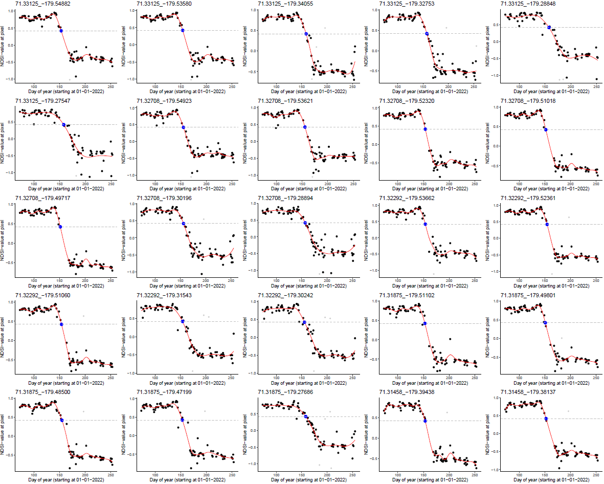 
 

 

  
  

 
 
				
### *02-RGEE_TomVersluijs_MODIS_Shapefile_Pixel_Snowmelt.R
Extract MODIS satellite data and calculate the date of snowmelt for every 500mx500m pixel in an area of interest (shapefile). 
Snowmelt is calculated per pixel by fitting a GAM through the average NDSI data and extracting the moment this GAM crosses a 
user specified NDSI threshold. This script requires a shapefile of the study area as input. The user can specify whether clouds 
and permanent waterbodies need to be masked from the analysis. After creating the snowmelt map, script "10-RGEE_TomVersluijs_S2_
ExtractSnowFraction.R" can be used to extract timeseries of the fraction of snowcover for points/polygon(s) of interest from this 
map.

  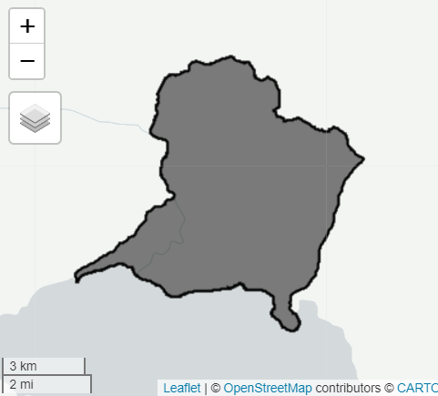
  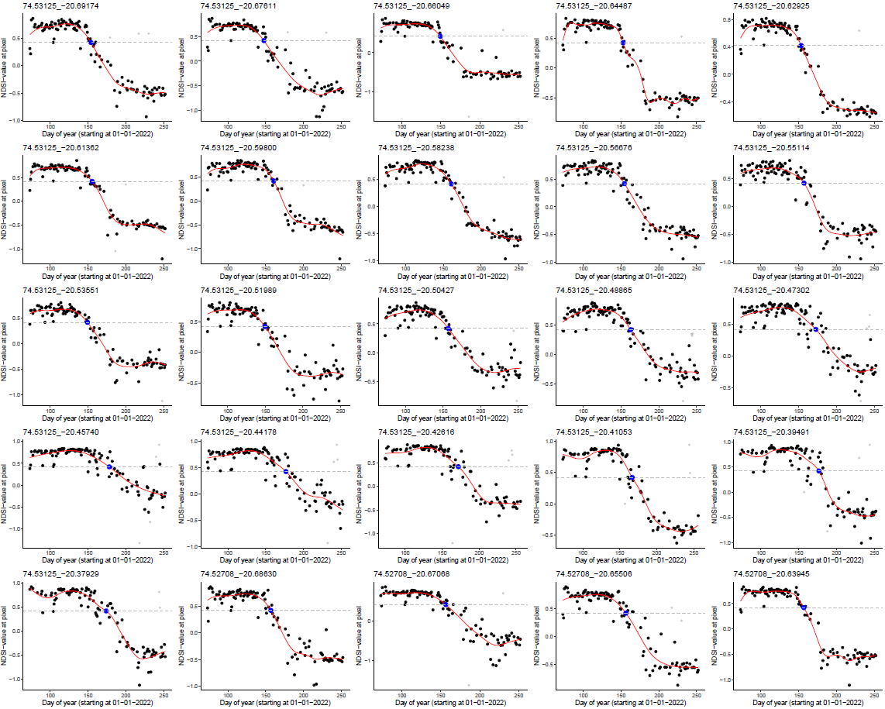

  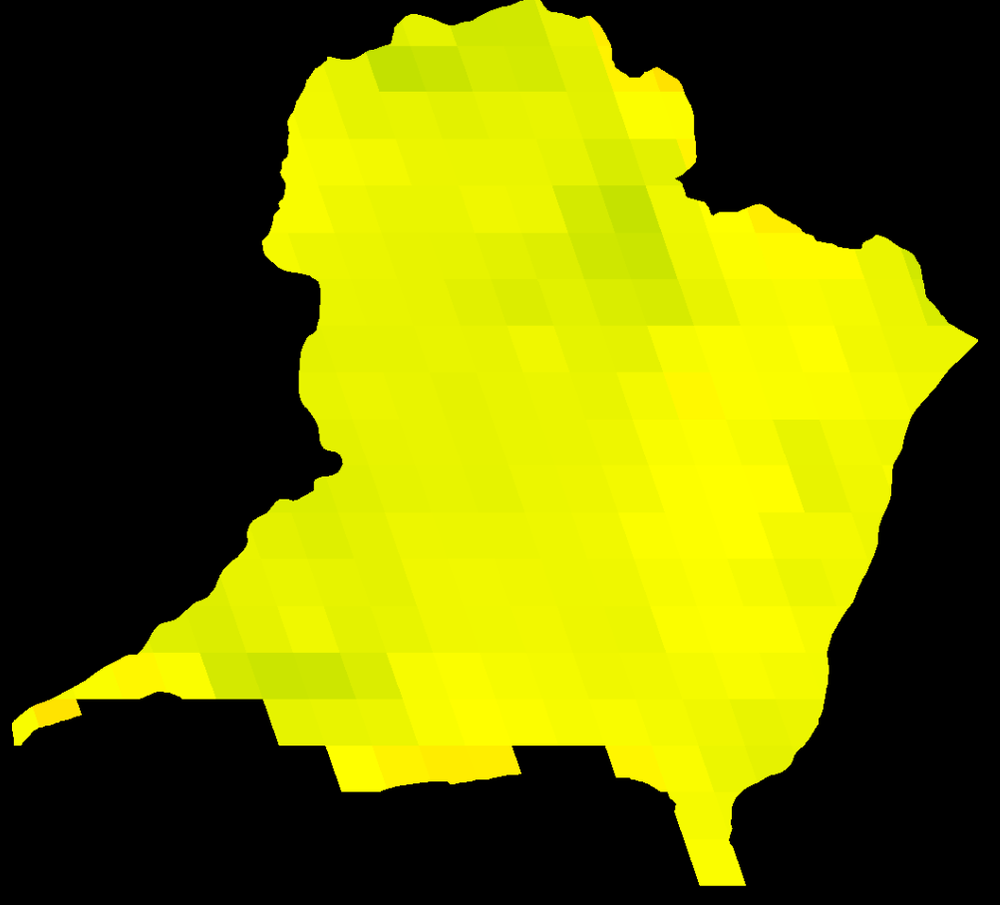 

 
 	
													   
### *03-RGEE_TomVersluijs_MODIS_Shapefile_Pixel_ChangeInSnowmelt.R
This script requires MODIS snowmelt maps generated using script "02-RGEE_TomVersluijs_MODIS_Shapefile_Pixel_Snowmelt.R" as input.
It imports the pixel-level maps for all analyzed years and transforms them into an image with the change in the date of snowmelt 
over the years for each pixel (i.e. slope of linear regression) and another image with the average date of snowmelt over the years 
for each pixel (i.e. intercept of linear regression).

  
  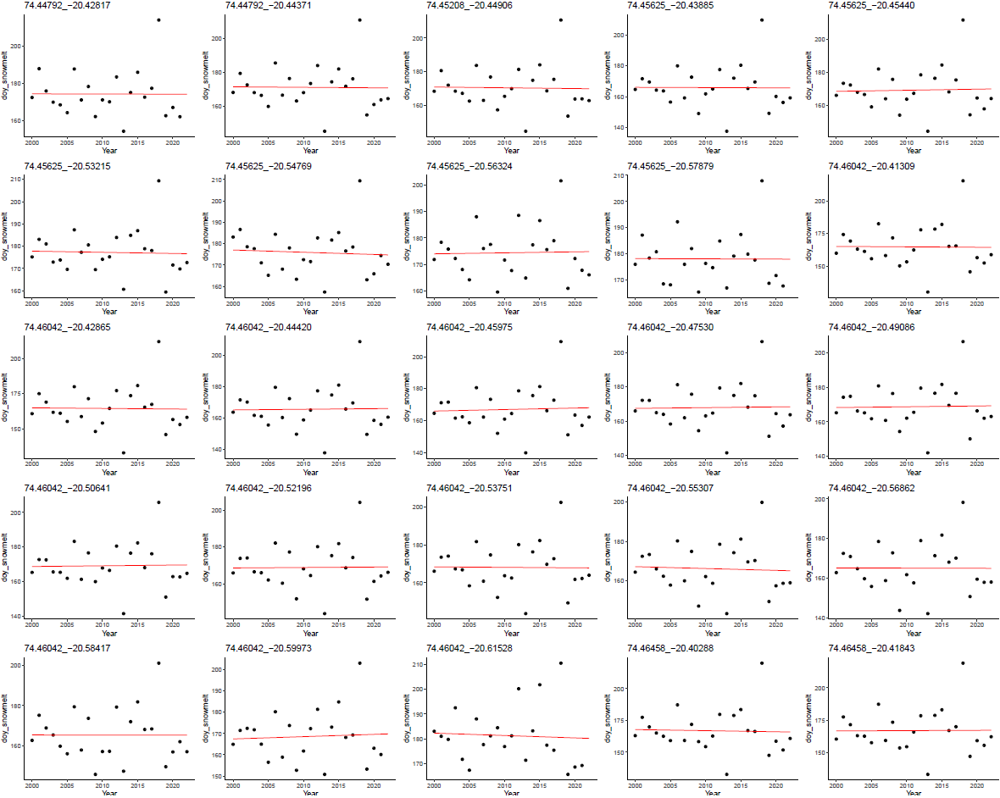

  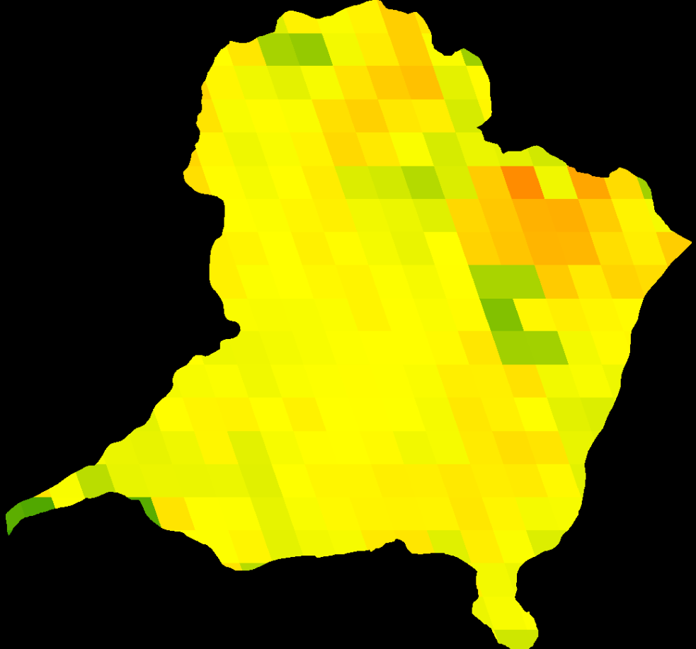 
  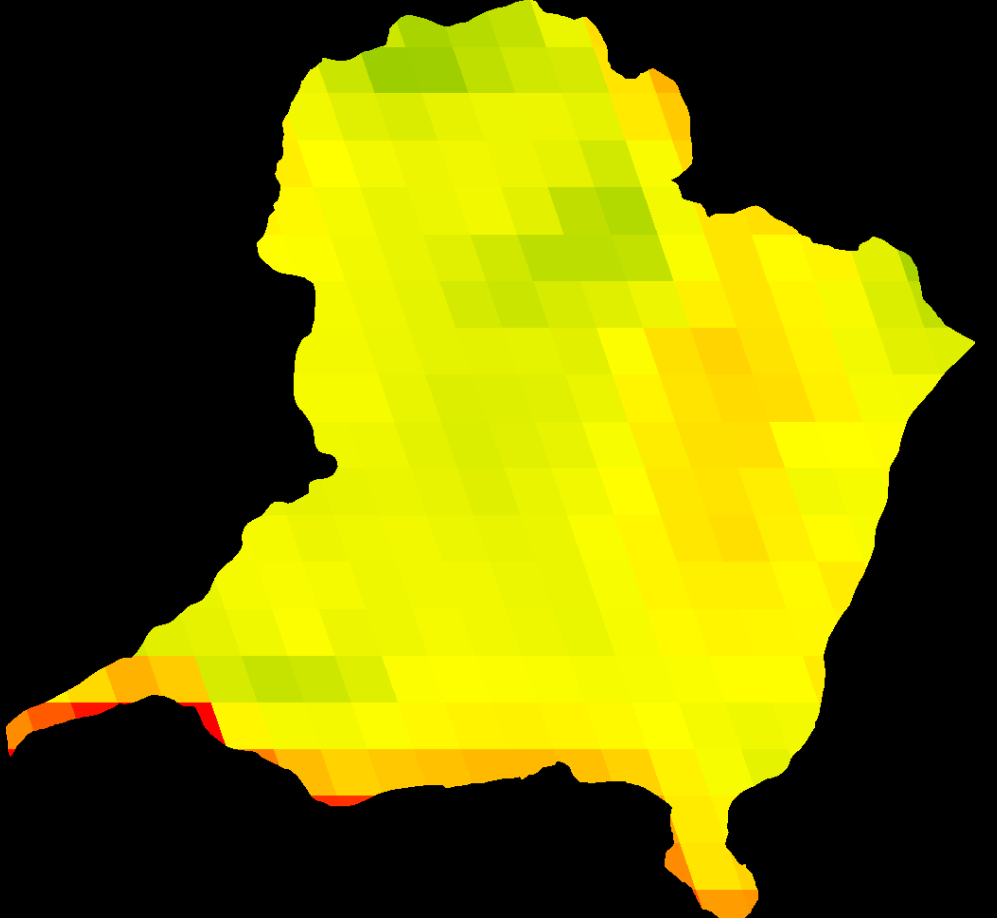 

 
 

### *10-RGEE_TomVersluijs_ExtractSnowFraction.R
Extract timeseries of the fraction of snowcover from a pixel-level snow melt map for a set of input locations. This corresponds 
to the method 'pixel_gam' in the other scripts. Input locations can either be point locations with a corresponding buffer zone, 
or a collection of polygons in a shapefile. This script depends on a snowmelt map generated using script "02-RGEE_TomVersluijs_
MODIS_Shapefile_Pixel_Snowmelt.R". Please run that script before running script 10. The same script can also be used to extract
these data from a Sentinel-2 snowmelt map.	

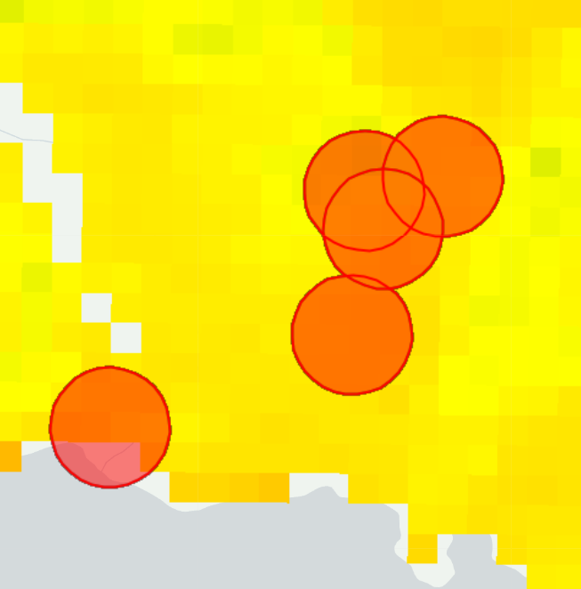 
  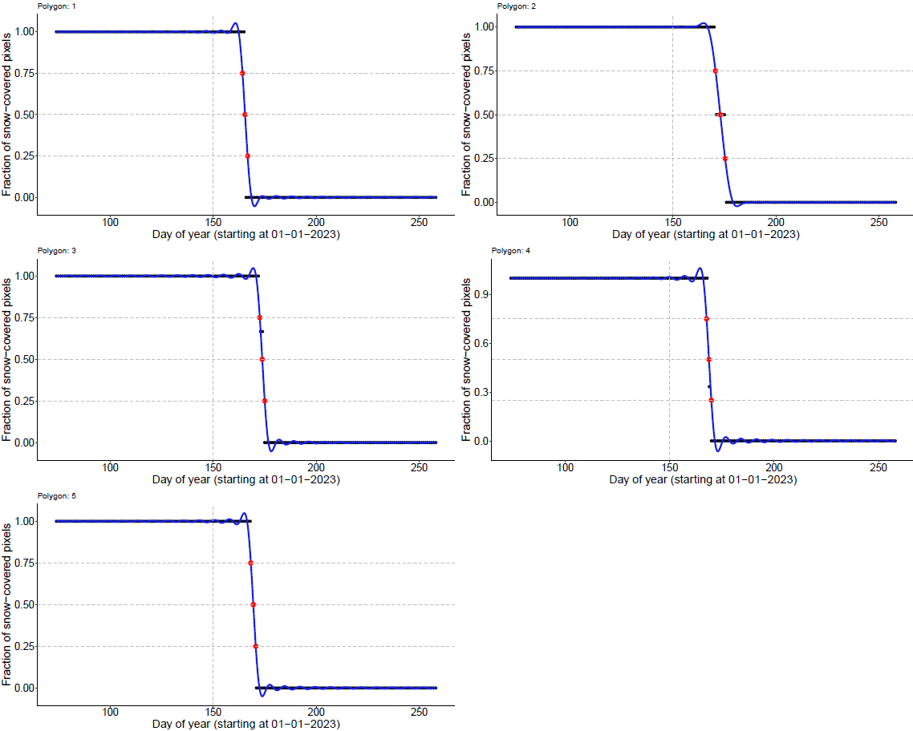

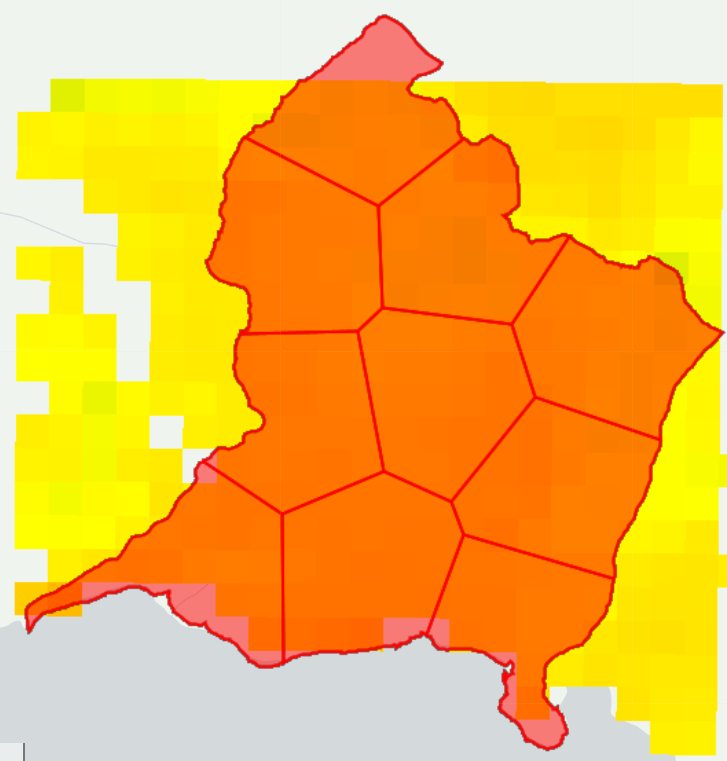 
  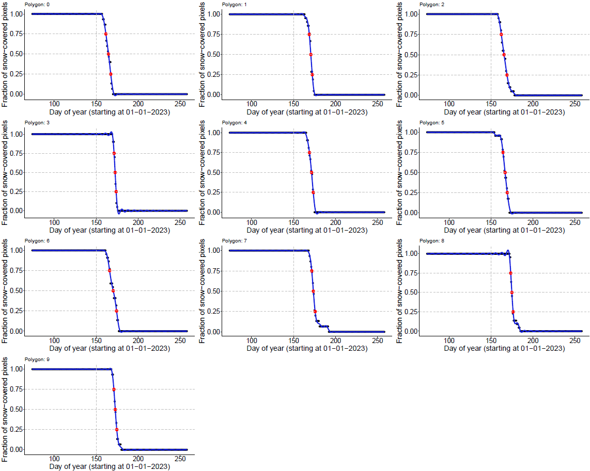

 
 

## SENTINEL-2 SCRIPTS:

### *04-RGEE_TomVersluijs_S2_Points_Snowmelt.R
In this script the timing of snow melt is calculated based on Sentinel-2 data for all point-locations specified in an input file. The
user can specify a bufferzone (radius) to depict the area in which snow melt will be analysed per location. <i> No shapefile is required as 
input for this script, which allows for input locations to be spaced far apart. All locations are analysed consecutively (using a loop). </i> 
First, a location specific bounding box is drawn per point location (taking into account the specified buffer zone) and Sentinel-2 
satellite data is extracted within this bounding box. Second, clouds and permanent water bodies can be filtered within this bounding 
box. Third, if this bounding box overlaps with multiple satellite tiles for a certain day, a composite image can be created (picking 
the pixel with least cloud cover). Finally, snow melt is analysed within each locations's buffer zone based on one of the following 
methods (specified by the user by setting the parameter 'method'): (1) 'avg_NDSI': Calculate the average NDSI value over time within 
each point's buffer zone, fit a GAM through these data and calculate when this model passes the specified NDSI threshold representing 
the moment of snow melt. In addition, time series of the average NDVI and NDMI are extracted within each point's buffer zone. (2) 
'snowfraction': Calculate the fraction of pixels within each buffer zone over time where NDSI > 'NDSI_threshold', fit a GAM through
these data and extract the moment when this model passes a user-specified 'Snowfraction_threshold'. (3): 'pixel_gam': Fit a GAM through 
the NDSI data for each pixel within each point's buffer zone, and calculate when this function passes NDSI_threshold. Then use these 
pixel-specific dates of snowmelt to calculate a fraction of snowcovered pixels for each day of year. Then fit a GAM through these 
pixel-specific snowfraction data and extract the moment when this model passes a user-specified 'Snowfraction_threshold'.This script 
is similar to the script '07-RGEE_TomVersluijs_S2_Shapefile_Points_Snowmelt'. However, in the latter script all points are analysed 
simultaneously. This has the restriction that it only works for rather small areas (<100km2) and that the user must load a shapefile 
to specify the outline of the study area in which all points of interest should be located. This works well when looking at a small 
area like Zackenberg. However, when points of interest are spaced further apart (like tracking data of migratory birds) the shapefile 
required to cover all these points is so large that this likely results in computation errors. The current script circumvents this 
issue because no shapefile is required as input. The downside of the current script is that it might take significantly longer to run 
than script '2-RGEE_TomVersluijs_Points.R'.							

  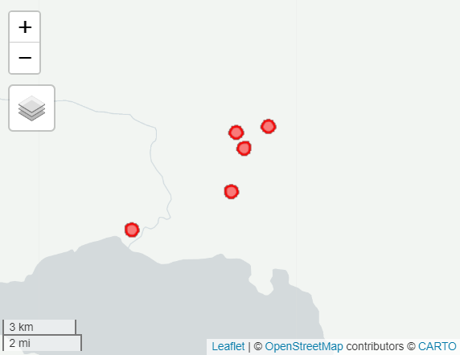
  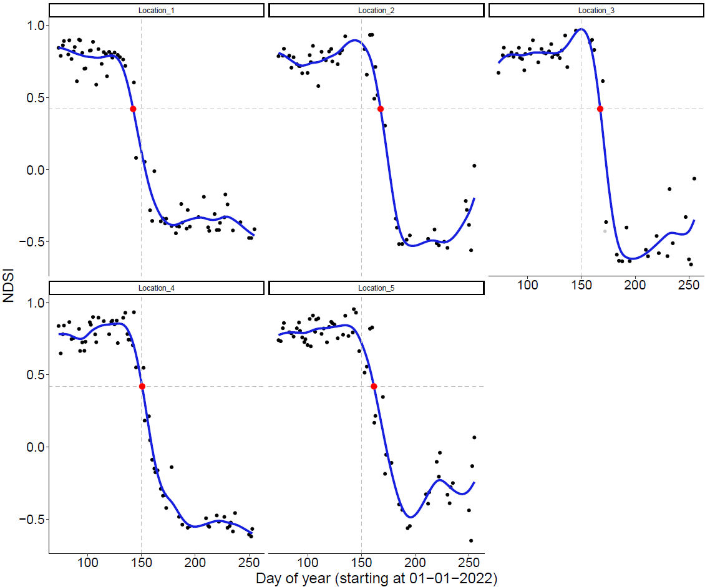 

  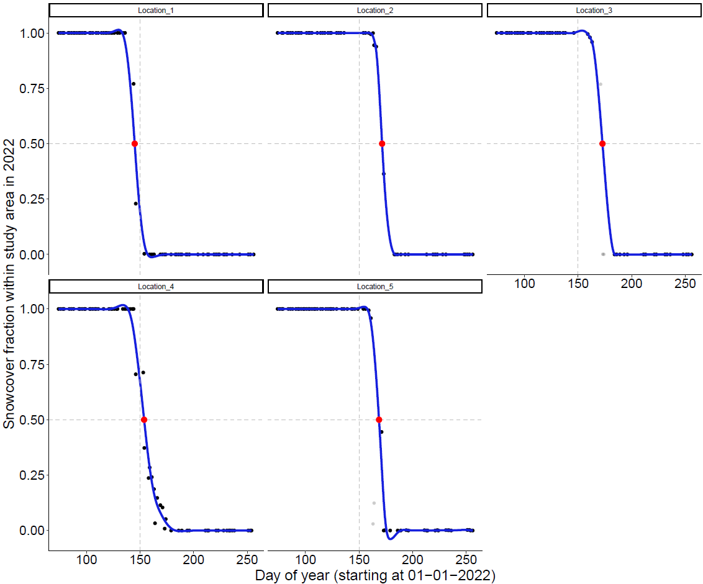

 
 	
								
### *05-RGEE_TomVersluijs_S2_Shapefile_Snowmelt.R 
Use Sentinel-2 data to extract time series of the average NDVI, NDMI, and NDSI and the fraction of snowcover for a single area of 
interest (i.e. a single shapefile). The fraction of snowcover is estimated by calculating the fraction of pixels with an NDSI value
larger than the user specified NDSI-threshold for each timestep. This corresponds to the method='snowfraction' in other scripts. 
The user can specify  whether clouds and permanent waterbodies need to be masked, and whether a composite image per day of year 
needs to be generated (merging multiple satellite photos for that day). <i>The current script requires a shapefile of the study area 
as input.</i> It only works for small areas of c.a. 50 km2 (larger areas might result in computation errors unless the spatial 
resolution of the analysis is decreased). Note that in this script (05), snowmelt is not calculated based on pixel-level snowmelt 
data (i.e. 'pixel_gam' method is not implemented). This approach is instead implemented in script "08-RGEE_TomVersluijs_S2_Shape
file_Pixel_Snowmelt.R" and involves fitting of GAMS through NDSI data per pixel and extracting the moment this GAM passes a user-
defined NDSI-threshold. This results in a pixel-level map of the date of snowmelt. Script "10-RGEE_TomVersluijs_S2_ExtractSnow
Fraction.R" can then be used to extract timeseries of the fraction of snowcover for points/polygon(s) of interest from this map.

  
  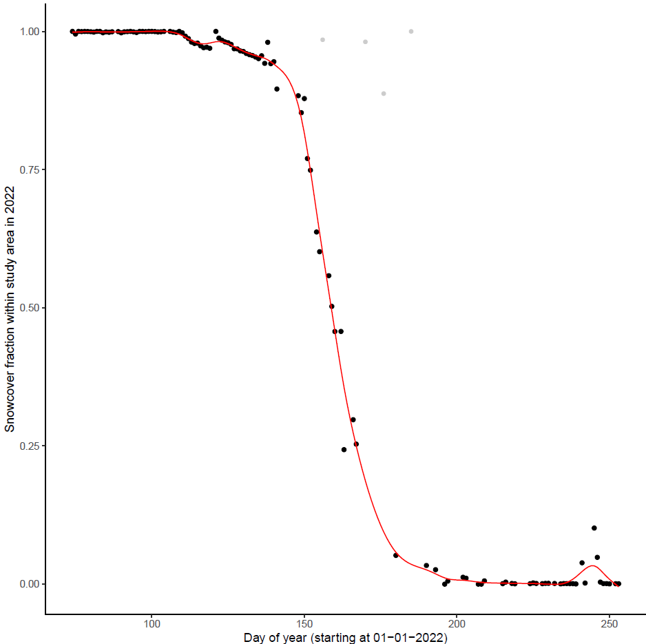 

 
 

### *06-RGEE_TomVersluijs_S2_Shapefile_SubAreas_Snowmelt.R
Use Sentinel-2 data to extract time series of (I) the average fractional snowcover (FSC), (II) the average NDVI, NDMI and NDSI,
and (III) the fraction of snowcover, for all sub areas located within a shapefile. These sub areas can be specified by creating a
multipolygon in e.g. QGIS (see manual). The fractional snowcover (FSC) is calculated based on two methods: following Gascoin et 
al 2020, and Aalstad et al 2020. This FSC is a within-pixel estimate of the fraction of snowcover, which is then averaged over
all pixels per subarea. The fraction of snowcover is instead estimated by calculating the fraction of pixels per subarea with an 
NDSI value larger than the user specified NDSI-threshold for each timestep. This corresponds to the method='snowfraction' in 
other scripts. The user can specify whether clouds and permanent waterbodies need to be masked, and whether a composite image 
per day of year needs to be generated (merging multiple satellite photos for that day). <i>The current script requires a shapefile 
of subareas within the study area as input.</i> It only works for small areas of c.a. 50 km2 (larger areas might result in 
computation errors unless the spatial resolution of the analyses is decreased). Note that in this script (06), snowmelt is not 
calculated based on pixel-level snowmelt data (i.e. 'pixel_gam' method is not implemented). This approach is instead implemented 
in script "08-RGEE_TomVersluijs_S2_Shapefile_Pixel_Snowmelt.R" and involves fitting of GAMS through NDSI data per pixel and 
extracting the moment this GAM passes a user-defined NDSI-threshold. This results in a pixel-level map of the date of snowmelt. 
Script "10-RGEE_TomVersluijs_S2_ExtractSnowFraction.R" can then be used to extract timeseries of the fraction of snowcover for 
points/polygons of interest from this map.

  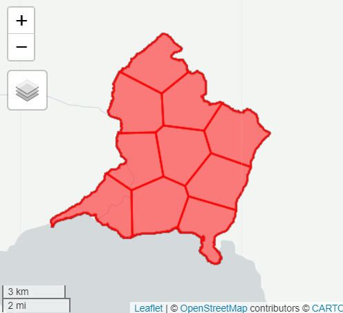
   

 
 

### *07-RGEE_TomVersluijs_S2_Shapefile_Points_Snowmelt.R
In this script the timing of snowmelt is calculated based on Sentinel-2 data for all point locations specified in an input file. The 
user can specify a bufferzone (radius) to depict the area in which snow melt will be analysed per location. <i> All locations (including 
buffer zone) are required to be located within a single shapefile and are then analysed simultaneously. </i> First, clouds and permanent 
water bodies can be filtered within the shapefile. Second, if the shapefile overlaps with multiple satellite tiles for a certain day,
a composite image can be created (picking the pixel with least cloudcover). Finally, snow melt is analysed for each location's buffer 
zone based on one of the following methods (specified by the user by setting the parameter 'method'): (1) 'avg_NDSI': Calculate the 
average NDSI value over time within each point's buffer zone, fits a GAM through these data and calculates when this model passes 
the specified NDSI threshold defining the moment of snow melt. In addition, time series of the average NDVI and NDMI are extracted 
within each point's buffer zone. (2) 'snowfraction': Calculate the fraction of pixels within each buffer zone over time where NDSI larger 
than 'NDSI_threshold', fits a GAM through these data and extract the moment when this model passes a user-specified 'Snowfraction_threshold'.
The 'snowfraction' method is preferred, because it intuitively makes sense to look a the fraction of snow-covered pixels over time.
It is harder to justify the 'avg_NDSI' method, because it is rather unclear what this average NDSI value entails. An even better approach 
is to calculate the date of snowmelt on a pixel level by fitting GAMS through pixel-level NDSI data (i.e. method = 'pixel_gam'), and to
use these pixel-level snowmelt dates to calculate the fraction of snow-covered pixels at each day of year. However, this approach
is not implemented in this script (07). Instead, it is implemented in script "04-RGEE_TomVersluijs_S2_Points_Snowmelt.R", and in script
"08-RGEE_TomVersluijs_S2_Shapefile_Pixel_Snowmelt.R". In the former script, these calculations are made for all pixels within the buffer
zone of point locations. In the latter script these calculates are made for all pixels within a user-specified shapefile, resulting in a 
pixel-level map of the timing of snowmelt. Script "10-RGEE_TomVersluijs_S2_ExtractSnowFraction.R" can then be used to extract timeseries 
of the fraction of snowcover for points/polygons of interest from this map. The current script (07) is similar to the script '04-RGEE_
TomVersluijs_S2_Points_Snowmelt.R'. However, in the latter script all points are analysed consecutively using a loop, which makes that 
script significantly slower to run. That script does not rely on a shapefile and thus works for points spaced much further apart (i.e. 
tracking data of migratory birds). The current script only works for small areas of c.a. 50-100 km2 (larger areas might result in 
computation errors unless the spatial resolution of the analyses is decreased).
	

  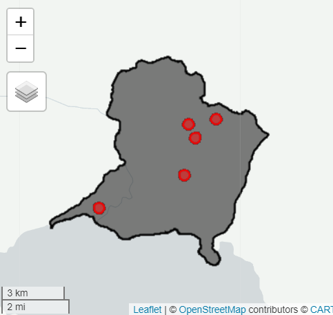
  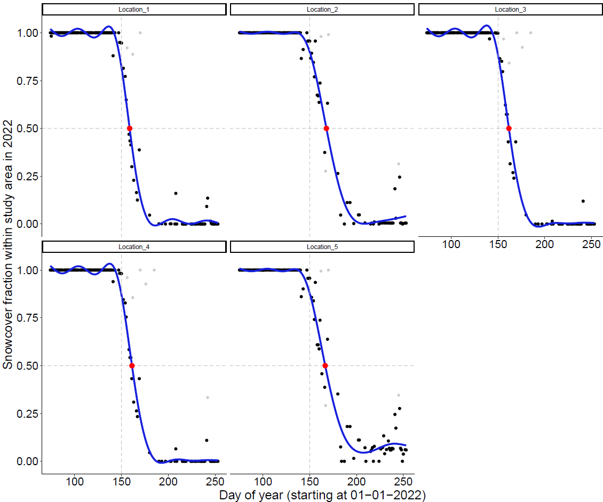 

 
 	

### *08-RGEE_TomVersluijs_S2_Shapefile_Pixel_Snowmelt.R
Use Sentinel-2 data to create pixel-level maps (20m resolution) of the date of snowmelt for an area up to c.a. 50km2. Snowmelt
is calculated per pixel by fitting a GAM through the average NDSI data and extracting the moment this GAM crosses a user specified
NDSI threshold. This script requires a single shapefile of the study area as input. The user can specify whether clouds and
permanent water bodies need to be masked. No composite image can be generated because this will result in computation errors.
After creating the snowmelt map, script "10-RGEE_TomVersluijs_S2_ExtractSnowFraction.R" can then be used to extract timeseries 
of the fraction of snowcover for points/polygon(s) of interest from this map.

  
  

								
 
 

### *09-RGEE_TomVersluijs_S2_Shapefile_Pixel_Snowmelt_LargeAreas.R
Use Sentinel-2 data to create pixel-level maps (20m resolution) of the date of snowmelt for an area up to c.a. 200km2. Snowmelt
is calculated per pixel by fitting a GAM through the average NDSI data and extracting the moment this GAM crosses a user specified
NDSI threshold. This script requires that the shapefile of the study area is split-up into exactly four smaller shapefiles to prevent 
memory issues on the GEE-server. No composite image can be generated because this will result in computation errors. After creating 
the snowmelt map, script "10-RGEE_TomVersluijs_S2_ExtractSnowFraction.R" can then be used to extract timeseries of the fraction of 
snowcover for points/polygon(s) of interest from this map.	

  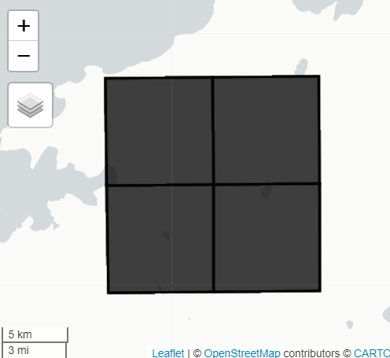
  

### *10-RGEE_TomVersluijs_ExtractSnowFraction.R
Extract timeseries of the fraction of snowcover from a pixel-level snow melt map for a set of input locations. This corresponds 
to the method 'pixel_gam' in the other scripts. Input locations can either be point locations with a corresponding buffer zone, 
or a collection of polygons in a shapefile. This script depends on a snowmelt map generated using script "08-RGEE_TomVersluijs_
S2_Shapefile_Pixel_Snowmelt.R". Please run that script before running script 10. The same script can also be used to extract
these data from a MODIS snowmelt map.	

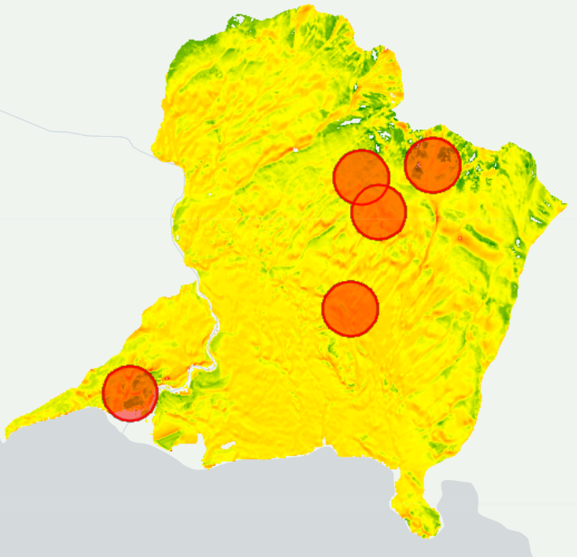 
  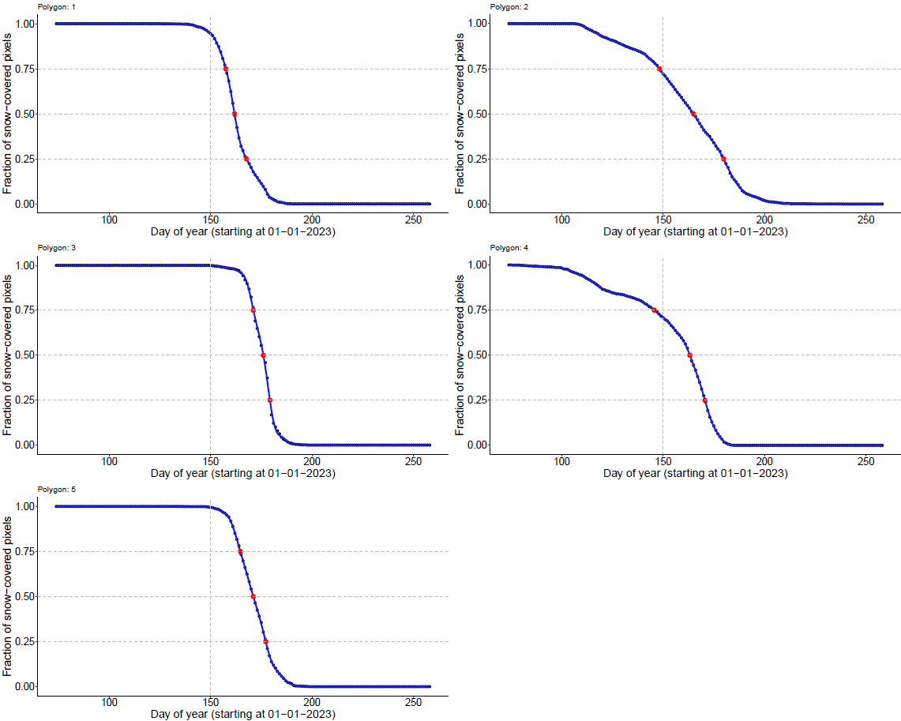

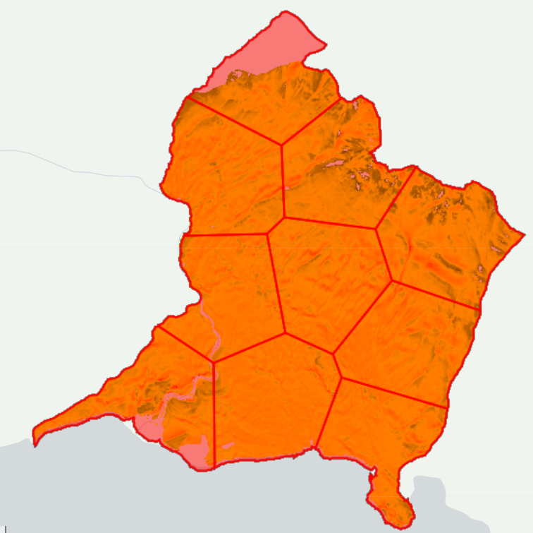 
  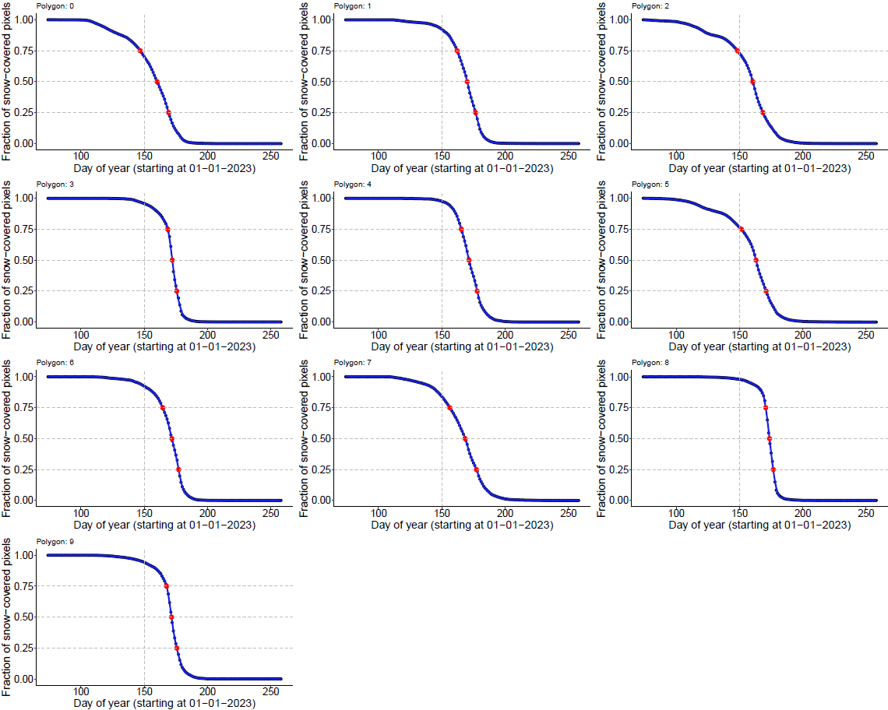

 
 
												