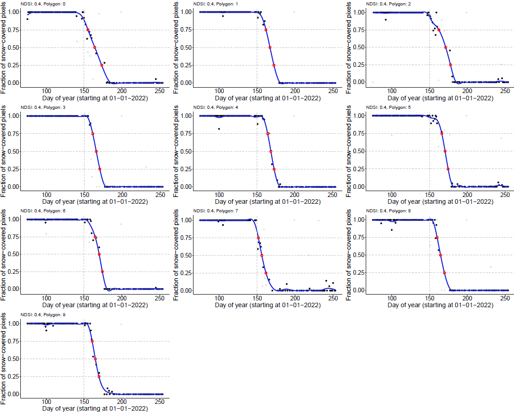

 

# Automated RGEE scripts to analyze the date of snow melt based on MODIS or Sentinel-2 satellite data.
All scripts in this Github respository rely on the R-package RGEE by Cesar Aybar et al. (https://github.com/r-spatial/rgee). These 
scripts provide an automated workflow to extract the timing of snow melt at the level of pixels, points, or polygons based on either 
MODIS or Sentinel-2 satellite data. While the user can specify the required parameters (resolution, spatial extent, date ranges, 
cloud/water filtering etc) the rest of the script automatically generates the required output data. This ReadMe file consists of
the following sections: (I) Usage notes, (II) Which script to use?, and (III) Detailed description of RGEE scripts.

Copyright: Tom S.L. Versluijs 2024 (tom.versluijs@gmail.com)

When using any of these scripts for scientific publications, please cite the original Github repository by following the provided
information in the file 'CITATION.cff' found in the root folder of this Github respository. In addition, also cite the RGEE package:
Aybar, C. rgee: R Bindings for Calling the 'Earth Engine' API (Version 1.1.7) [Computer software]. https://github.com/r-spatial/rgee/issues/
 
 

#######################################################################################

# (I) USAGE NOTES

#######################################################################################

-(1) To run these scripts it is mandatory to have a Google Account, and a Google Cloud Project registered for non-commercial use (see installation script '00-RGEE_TomVersluijs_Installation.R').

-(2) Make sure to download the complete Github folder 'RGEE_Snowmelt' to ensure that all dependencies between input files, scripts and output folders function properly. The complete repository 
     can be cloned to your own Github repository using '<>Code/Clone', or to your local drive using '<>Code/Download ZIP'. IMPORTANT: make sure that you place the folder on a directory to which 
	 you have admin rights.
	 
-(3) All scripts in this Github folder need to be run from within the R-project "RGEE_Snowmelt.Rproj" in the root directory. Thus, first open the 'RGEE_Snowmelt.Rproj' file in RStudio, and then
     select the required script under 'Files/RGEE/R-scripts', or "/File/Open file..."	 

-(4) All scripts are completely automated and require the user to only alter parameters in the "#Specify parameters of interest" section at the start of each script. After adjusting these 
     parameters, the complete code can be selected (CTRL-A) and can be run at once (CTRL + ENTER, or CTRL + R, or by clicking Run in R-Studio). 
	 
-(5) Update to the newest versions of R and R-Studio before running the scripts. The scripts were developed with R-version 4.3.2 and R-Studio 2023.12.1 build 402.
	 
-(6) If the R-package 'RGEE' has not yet been installed, or does not function properly, make sure to install RGEE and its python dependencies using the script "00-RGEE_TomVersluijs_Installation.R". 
     Note that getting RGEE to function properly can be quite a frustrating first hurdle to take. Things will get easier once everything is up and running!
	 
-(7) It is recommended to use the default library() and p_load() functions in each script to install the newest versions of all required R-packages and their dependencies.	However, if this results  
     in an error, then the latest versions of R-packages (including dependencies) that were used to succesfully run the scripts are stored in the file "renv.lock". These specific versions can be 
	 downloaded and installed by running renv::restore() at the beginning of each script.	  
	 
-(8) All scripts rely on auxiliary scripts in the /RGEE/Input folder that specify commonly used functions. These auxiliary scripts are automatically sourced at the beginning of all main scripts. 

-(9) Several scripts require a shapefile of the study area as input. To construct these shapefiles follow the QGIS manual "Manual_QGIS_CreateShapefilePolygons" found in /RGEE/Manuals. After 
     creating your own shapefile(s), place them in the /RGEE/Input/Shapefiles directory.
	 
-(10) Each script generates its own output folder in the /RGEE/Output folder in the root directory.
	 
-(11) Sentinel-2 scripts can be computationally demanding and depending on the occupancy of the Google Earth Engine servers might take up to 16 hours to complete! The servers can sometimes be
     so busy that the script returns a 'computation time out' or 'computation error'. If this happens, please try to run the script again at some other time. If the code still results in an
	 computation error then your spatial extend is probably to large for the specified resolution. Either decrease the spatial resolution of the analysis by setting the parameter 'resolution',
	 or reduce the spatial extent of the analysis.
	 
-(12) For questions regarding potential errors and bugs please contact tom.versluijs@gmail.com.
 
 

#######################################################################################

# (II) WHICH SCRIPT TO USE?

#######################################################################################

For a more thorough description of all RGEE scripts, see the section 'DETAILED DESCRIPTION OF RGEE SCRIPTS' below.

### General comparison of MODIS and Sentinel-2
The R-scripts provided below either extract MODIS or Sentinel-2 satellite data. The choice between either satellite depends
mostly on the required spatial resolution (MODIS=500m, sentinel-2=20m), and how far back in time you want to analyze these data
(MODIS since 2000, Sentinel-2 since 2016). Moreover, if you aim to analyze very large spatial extents (>50-250km2) then Sentinel-2
scripts often result in a computation error (even when manually specifying a lower spatial resolution). In that case MODIS might
be a better choice. Below, you can find a few queries to aid in picking the right script for your research question.

### Which years do you want to analyse?
* MODIS: 	 	
	* years: 2000 - current
	* scripts: 01 - 04 and 10

* Sentinel-2: 	
	* years: 2016 - current
	* scripts: 05 - 10

### What is the required spatial resolution of your analysis?
* MODIS: 	 	
	* resolution: 500 meter			
	* scripts: 01 - 04 and 10

* Sentinel-2:  	
	* resolution: 20 meter
	* scripts: 05 - 10

### MODIS scripts: what kind of data do you want to analyse?
* Date of snow melt at all **`pixels`** within a single polygon area
	* Script 01

* Date of snow melt at multiple **`point locations`** (with or without buffer)				
	* Script 02

* Date of snow melt within a single or multiple **`polygon areas`**		
	* Script 03

* Change in the date of snow melt per pixel within a single polygon area												
	* Script 04

* Extract time series of the fraction of snowcovered pixels at point- or polygon locations from a snow melt image (relies on script 01) 															
	* Script 10

### Sentinel-2 scripts: what kind of data do you want to analyse?
* Date of snow melt at all **`pixels`** within a small polygon area (<50km2)
	* Script 05

* Date of snow melt at multiple **`point locations`** (with or without buffer)				
	* Script 06

* Date of snow melt within a single or multiple **`polygon areas`**		
	* Script 07

* Date of snow melt at multiple point locations (with or without buffer) located within a small shapefile area (<50km2)	
	* Script 08

* Date of snow melt for all pixels within a large polygon area (< 250km2)												
	* Script 09

* Extract time series of the fraction of snowcovered pixels at point- or polygon locations from a snow melt image (relies on script 05)													
	* Script 10	
 
 

#######################################################################################

# (III) DETAILED DESCRIPTION OF RGEE SCRIPTS

#######################################################################################

## GENERAL SCRIPTS:

### *00-RGEE_TomVersluijs_Installation.R
Script to install RGEE and all its dependencies. It allows the user to manually set the Python path, and to create a Google Cloud Project. 
This script is adapted from a tutorial by Ricardo Dal'Agnol da Silva.

## MODIS SCRIPTS:

### *01-RGEE_TomVersluijs_MODIS_Pixels_Snowmelt.R
Extract MODIS satellite data and calculate the date of snow melt for every 500mx500m **`pixel`** in an area of interest (shapefile). 
The user can specify whether clouds and permanent waterbodies need to be masked. Snow melt is calculated per pixel by fitting 
a GAM through the average NDSI data and by extracting the moment this GAM crosses a user specified NDSI threshold. After 
creating the snow melt map, script "10-RGEE_TomVersluijs_S2_ExtractSnowFraction.R" can be used to extract time series of the 
fraction of snow cover for points/polygon(s) of interest from this map.

   
  

 
 	

### *02-RGEE_TomVersluijs_MODIS_Points_Snowmelt.R
The date of snow melt is calculated based on MODIS data for all **`point locations`** specified in an input file. The user can specify
a buffer zone (radius) to depict the area in which snow melt will be analysed per location. <i>No shapefile is required as input for 
this script, which allows for point locations to be spaced far apart.</i> The user can specify whether clouds and permanent waterbodies 
need to be masked. Snow melt is analysed within each location's buffer zone based on one of the following methods (specified by the 
user by setting the parameter 'method'): 

* (1) <i>'avg_NDSI'</i>: Calculate the average NDSI value over time within each point's buffer zone, fit a GAM through these data and calculate when this model passes the specified NDSI threshold representing the moment of snow melt. In addition, time series of the average NDVI and NDMI are extracted within each point's buffer zone. 
* (2) <i>'snowfraction'</i>: Calculate the fraction of pixels within each buffer zone over time where NDSI > 'NDSI_threshold', fit a GAM through these data and extract the moment when this model passes a user-specified 'Snowfraction_threshold'. 
* (3) <i>'pixel_gam'</i>: Fit a GAM through the NDSI data for each pixel within each point's buffer zone, and calculate when this function passes NDSI_threshold. Then use these pixel-specific dates of snow melt to calculate a fraction of snowcovered pixels for each day of year. Then fit a GAM through these pixel-specific snowfraction data and extract the moment when this model passes a user-specified 'Snowfraction_threshold'. 				

  
  
  

 
 
				
### *03-RGEE_TomVersluijs_MODIS_Polygons_Snowmelt.R
The date of snow melt is calculated based on MODIS data for a single **`polygon`**, or **`multi-polygon** specified using a shapefile. 
This shapefile can be created using e.g. QGIS (see manual). The user can specify whether clouds and permanent water bodies need to be masked.
Snow melt is analysed within each polygon based on one of the following methods (specified by the user by setting the parameter 'method'):

* (1) <i>'avg_NDSI'</i>: Calculate the average NDSI value over time within each polygon, fit a GAM through these data and calculate when this model passes the specified NDSI threshold representing the moment of snow melt. In addition, time series of the average NDVI and NDMI are extracted within each polygon. Also, time series of the average Fractional Snow Cover (FSC, a within-pixel estimate of the fraction of snow cover) are extracted within each polygon based on the formulas specified in Gascoin et al 2020 and Aalstad et al 2020.
* (2) <i>'snowfraction'</i>: Calculate the fraction of pixels within each buffer zone over time where NDSI > 'NDSI_threshold', fit a GAM through these data and extract the moment when this model passes a user-specified 'Snowfraction_threshold'. 

Note that snow melt is not calculated based on pixel-level GAM fits (i.e. 'pixel_gam' method is not implemented). This approach is instead 
implemented for a single polygon in script "01-RGEE_TomVersluijs_MODIS_Pixels_Snowmelt.R" and involves fitting of GAMS through NDSI data 
per pixel and extracting the moment this GAM passes a user-defined NDSI-threshold. This results in a pixel-level map of the date of 
snow melt. Script "10-RGEE_TomVersluijs_ExtractSnowFraction.R" can then be used to extract time series of the fraction of snowcover for 
points/polygons of interest from this map.

  
   

 
 
													   
### *04-RGEE_TomVersluijs_MODIS_Pixels_ChangeInSnowmelt.R
This script requires MODIS snow melt maps generated using script "02-RGEE_TomVersluijs_MODIS_Shapefile_Pixel_Snowmelt.R" as input.
It imports the pixel-level maps for all analyzed years and transforms them into an image with the change in the date of snow melt 
over the years for each pixel (i.e. slope of linear regression) and another image with the average date of snow melt over the years 
for each pixel (i.e. intercept of linear regression).

   
   

 
 

### *10-RGEE_TomVersluijs_ExtractSnowFraction.R
Extract time series of the fraction of snowcover from a pixel-level snow melt map for a set of input locations. This corresponds 
to the method 'pixel_gam' in the other scripts. Input locations can either be point locations with a corresponding buffer zone, 
or a collection of polygons in a shapefile. This script depends on a snow melt map generated for MODIS using script "01-RGEE_
TomVersluijs_MODIS_Pixels_Snowmelt.R", or for Sentinel-2 using script "05-RGEE_TomVersluijs_S2_Pixels_Snowmelt.R". Please run 
either script before continuing with the analysis below.

 
   
  

 
 

## SENTINEL-2 SCRIPTS:

### *05-RGEE_TomVersluijs_S2_Pixels_Snowmelt.R
Extract Sentinel-2 satellite data and calculate the date of snow melt for every 20mx20m **`pixel`** within an area up to c.a. 
50km2. The user can specify whether clouds and permanent waterbodies need to be masked. Snow melt is calculated per pixel by 
fitting a GAM through the average NDSI data and by extracting the moment this GAM crosses a user specified NDSI threshold. 
After creating the snow melt map, script "10-RGEE_TomVersluijs_S2_ExtractSnowFraction.R" can be used to extract time series of 
the fraction of snow cover for points/polygon(s) of interest from this map.

  
  

								
 
 

### *06-RGEE_TomVersluijs_S2_Points_Snowmelt.R
The date of snow melt is calculated based on Sentinel-2 data for all **`point locations`** specified in an input file. The user can 
specify a buffer zone (radius) to depict the area in which snow melt will be analysed per location. All locations are analysed 
consecutively (using a loop). <i>No shapefile is required as input for this script, which allows for point locations to be spaced 
far apart.</i> The user can specify whether clouds and permanent waterbodies need to be masked. If the area of interest overlaps
with multiple satellite tiles for a certain day, then a composite image can be created (picking the pixel with the least cloud
cover). Snow melt is analysed within each location's buffer zone based on one of the following methods (specified by the 
user by setting the parameter 'method'): 

* (1) <i>'avg_NDSI'</i>: Calculate the average NDSI value over time within each point's buffer zone, fit a GAM through these data and calculate when this model passes the specified NDSI threshold representing the moment of snow melt. In addition, time series of the average NDVI and NDMI are extracted within each point's buffer zone. 
* (2) <i>'snowfraction'</i>: Calculate the fraction of pixels within each buffer zone over time where NDSI > 'NDSI_threshold', fit a GAM through these data and extract the moment when this model passes a user-specified 'Snowfraction_threshold'. 
* (3) <i>'pixel_gam'</i>: Fit a GAM through the NDSI data for each pixel within each point's buffer zone, and calculate when this function passes NDSI_threshold. Then use these pixel-specific dates of snow melt to calculate a fraction of snowcovered pixels for each day of year. Then fit a GAM through these pixel-specific snowfraction data and extract the moment when this model passes a user-specified 'Snowfraction_threshold'. 	

This script is similar to the script '08-RGEE_TomVersluijs_S2_Shapefile_Points_Snowmelt'. However, in the latter script all points are 
analysed simultaneously. This has the restriction that it only works for rather small areas (<100km2) and that the user must load a 
shapefile to specify the outline of the study area in which all points of interest should be located. This works well when looking 
at a small area. However, when points of interest are spaced further apart (like tracking data of migratory birds) the shapefile 
required to cover all these points is so large that this likely results in computation errors. The current script circumvents this 
issue because no shapefile is required as input. The downside of the current script is that it might take significantly longer to 
run than script '08-RGEE_TomVersluijs_S2_Shapefile_Points_Snowmelt'.					

  
   

 
 
								
### *07-RGEE_TomVersluijs_S2_Polygons_Snowmelt.R
The date of snow melt is calculated based on Sentinel-2 data for a single **`polygon`**, or **`multi-polygon** specified using a shapefile. 
This shapefile can be created using e.g. QGIS (see manual). It only works for small areas of c.a. 50 km2 (larger areas might result in 
computation errors unless the spatial resolution of the analyses is decreased).The user can specify whether clouds and permanent water 
bodies need to be masked. If the area of interest overlaps with multiple satellite tiles for a certain day, then a composite image can be 
created (picking the pixel with the least cloud cover). Snow melt is analysed within each polygon based on one of the following methods 
(specified by the user by setting the parameter 'method'):

* (1) '<i>avg_NDSI</i>': Calculate the average NDSI value over time within each polygon, fit a GAM through these data and calculate when this model passes the specified NDSI threshold representing the moment of snow melt. In addition, time series of the average NDVI and NDMI are extracted within each polygon. Also, time series of the average Fractional Snow Cover (FSC, a within-pixel estimate of the fraction of snow cover) are extracted within each polygon based on the formulas specified in Gascoin et al 2020 and Aalstad et al 2020.
* (2) '<i>snowfraction</i>': Calculate the fraction of pixels within each buffer zone over time where NDSI > 'NDSI_threshold', fit a GAM through these data and extract the moment when this model passes a user-specified 'Snowfraction_threshold'. 

Note that snow melt is not calculated based on pixel-level GAM fits (i.e. 'pixel_gam' method is not implemented). This approach is instead 
implemented for a single polygon in script "05-RGEE_TomVersluijs_S2_Pixels_Snowmelt.R" and involves fitting of GAMS through NDSI data 
per pixel and extracting the moment this GAM passes a user-defined NDSI-threshold. This results in a pixel-level map of the date of 
snow melt. Script "10-RGEE_TomVersluijs_ExtractSnowFraction.R" can then be used to extract time series of the fraction of snowcover for 
points/polygons of interest from this map.

  
   

 
 

### *08-RGEE_TomVersluijs_S2_Shapefile_Points_Snowmelt.R
The timing of snow melt is calculated based on Sentinel-2 data for all point locations located within a single polygon. The user
can specify a buffer zone (radius) to depict the area in which snow melt will be analysed per location. <i> All locations (including 
buffer zone) are required to be located within a single shapefile and are then analysed simultaneously. </i> First, clouds and 
permanent water bodies are filtered within the shapefile. Second, if the shapefile overlaps with multiple satellite tiles for a 
certain day, a composite image is created (picking the pixel with least cloudcover). Finally, snow melt is analysed for each 
location's buffer zone based on one of the following methods (specified by the user by setting the parameter 'method'):

* (1): '<i>avg_NDSI</i>':  	 Calculate the average NDSI value over time within each point's buffer zone, fits a GAM through these data and calculates when this model passes the specified NDSI threshold defining the moment of snow melt. In addition, time series of the average NDVI and NDMI are extracted within each point's buffer zone.
* (2): '<i>snowfraction</i>': Calculate the fraction of pixels within each buffer zone over time where NDSI > 'NDSI_threshold', fits a GAM through these data and extract the moment when this model passes a user-specified 'Snowfraction_threshold'.

Note that snow melt is not calculated based on pixel-level GAM fits (i.e. 'pixel_gam' method is not implemented). This approach is instead 
implemented in script "06-RGEE_TomVersluijs_S2_Points_Snowmelt.R", and in script "05-RGEE_TomVersluijs_S2_Pixels_Snowmelt.R". In the former 
script, these calculations are made for all pixels within the buffer zone of point locations. In the latter script these calculates are made 
for all pixels within a single polygon, resulting in a pixel-level map of the timing of snow melt. Script "10-RGEE_TomVersluijs_Extract
SnowFraction.R" can then be used to extract time series of the fraction of snowcover for points/polygons of interest from this map.

The current script (08) is similar to the script '06-RGEE_TomVersluijs_S2_Points_Snowmelt.R'. However, in the latter script all points 
are analysed consecutively using a loop, which makes that script significantly slower to run. That script does not rely on a shapefile 
and thus works for points spaced much further apart (i.e. tracking data of migratory birds). Script 08 only works for small areas of c.a.
50-100 km2 (larger areas might result in computation errors unless the spatial resolution of the analyses is decreased). In addition, the
'pixel_gam' method is implemented in script "06", but not in the current script "08".
	

  
   

 
 	

### *09-RGEE_TomVersluijs_S2_Pixels_Snowmelt_LargeAreas.R
Extract Sentinel-2 satellite data and calculate the date of snow melt for every 20mx20m **`pixel`** within an area up to c.a. 
250km2. The user can specify whether clouds and permanent waterbodies need to be masked. This script requires that the shapefile 
of the study area is split-up into exactly four smaller shapefiles to prevent memory issues on the GEE-server. Snow melt is 
calculated per pixel by fitting a GAM through the average NDSI data and by extracting the moment this GAM crosses a user 
specified NDSI threshold. After creating the snow melt map, script "10-RGEE_TomVersluijs_ExtractSnowFraction.R" can be used 
to extract time series of the fraction of snow cover for points/polygon(s) of interest from this map.

  
  

### *10-RGEE_TomVersluijs_ExtractSnowFraction.R
Extract time series of the fraction of snowcover from a pixel-level snow melt map for a set of input locations. This corresponds 
to the method 'pixel_gam' in the other scripts. Input locations can either be point locations with a corresponding buffer zone, 
or a collection of polygons in a shapefile. This script depends on a snow melt map generated for MODIS using script "01-RGEE_
TomVersluijs_MODIS_Pixels_Snowmelt.R", or for Sentinel-2 using script "05-RGEE_TomVersluijs_S2_Pixels_Snowmelt.R". Please run 
either script before continuing with the analysis below.

 
 
  

 
 
												