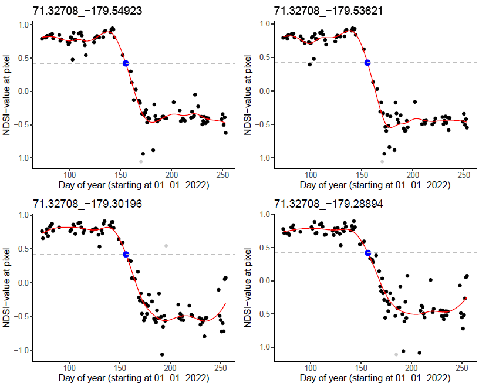
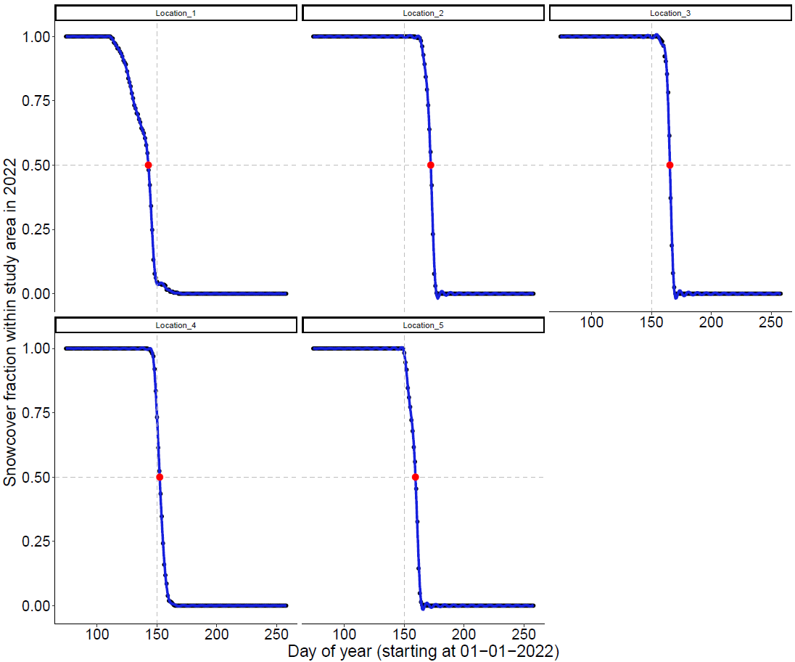

#######################################################################################

# Automated RGEE scripts to analyze the timing of snowmelt, and timeseries of NDSI, NDVI and NDMI based on MODIS or Sentinel-2 satellite data.

## Copyright: Tom Versluijs 2023

#######################################################################################

# (I) USAGE NOTES

#######################################################################################

-(1) Make sure to download the complete github folder 'RGEE' to make sure all dependencies between input files, scripts and output files function properly.

-(2) Update to the newest versions of R and R-Studio before running the scripts.

-(3) If RGEE has not yet been installed, or does no function properly, make sure to install RGEE and its python dependencies using the script "00-RGEE_TomVersluijs_Installation.R". Note that
     getting RGEE to function properly can be quite a frustrating first hurdle to take. Things will get easier once everything is up and running!
	 
-(4) All scripts in this Github folder need to be run from within the R-project "RGEE.Rproj" in the root directory. Thus, first open the 'RGEE.Rproj' file in RStudio, and then select
     the required script under 'Files/RGEE/R-scripts', or "/File/Open file..."
	 
-(5) All scripts rely on auxiliary scripts in the /RGEE/Input folder that specify commonly used functions. These auxiliary scripts are automatically sourced at the beginning of all main scripts. 

-(6) Several scripts rely on a shapefile of the study area as input. To construct these shapefiles follow the QGIS manual "Manual_QGIS_CreateShapefilePolygons" found in /RGEE/Manuals. After 
     creating your own shapefile(s), place them in the /RGEE/Input/Shapefiles directory.
	 
-(7) Each script generates its own output folder in the /RGEE/Output folder in the root directory.

-(8) All scripts are completely automated and require the user to only alter parameters in the "#Specify parameters of interest" section at the start of each script. After adjusting these 
     parameters the complete code can be selected (CTRL-A) and can be run at once (CTRL + ENTER, or CTRL + R, or by clicking Run in R-Studio).
	 
-(9) Sentinel-2 scripts can be computationally demanding and depending on the occupancy of the Google Earth Engine servers might take up to 16 hours to complete! The servers can sometimes be
     so busy that the script returns a 'computation time out' or 'computation error'. If this happens, please try to run the script again at some other time.
	 
-(10)For questions regarding potential errors and bugs please contact tom.versluijs@gmail.com.

#######################################################################################

# (II) WHICH SCRIPT TO USE?

#######################################################################################

For a more thorough description of all RGEE scripts, see the section 'DETAILED DESCRIPTION OF RGEE SCRIPTS' below.

### Which years do you want to analyse?
* MODIS: 	 	
	* years: 2000 - current
	* scripts: 01 - 04

* Sentinel-2: 	
	* years: 2016 - current
	* scripts: 05 - 11

### What is the required spatial resolution of your analysis?
* MODIS: 	 	
	* resolution: 500 meter			
	* scripts: 01 - 04

* Sentinel-2:  	
	* resolution: 10 meter
	* scripts: 05 - 11

### MODIS scripts: what kind of data do you want to analyse?
* Date of snowmelt, and average NDSI, NDVI and NDMI at point locations located across the globe							
	* Script 01

* Date of snowmelt at all pixels within a shapefile area																
	* Script 02

* Date of snowfall at all pixels within a shapefile area																
	* Script 03

* Change in date of snowmelt per pixel within a shapefile area 															
	* Script 04

### Sentinel-2 scripts: what kind of data do you want to analyse?
* Date of snowmelt, and average NDSI, NDVI and NDMI at point locations located across the globe							
	* Script 05

* Date of snowmelt, and average NDSI, NDVI and NDMI within a small shapefile (<50km2)									
	* Script 06

* Date of snowmelt, and average NDSI, NDVI and NDMI at subareas located within a small shapefile area (<50km2)			
	* Script 07

* Date of snowmelt, and average NDSI, NDVI and NDMI at point locations located within a small shapefile area (<50km2)	
	* Script 08

* Date of snowmelt at all pixels within a small shapefile (area < 50km2)												
	* Script 09
	
* Date of snowmelt at all pixels within a large shapefile (area < 200km2)												
	* Script 10

* Relative pixelvalues per timestep within a small shapefile (area < 50km2)												
	* Script 11

#######################################################################################

# (III) DETAILED DESCRIPTION OF RGEE SCRIPTS

#######################################################################################

## GENERAL SCRIPTS:

### *00-RGEE_TomVersluijs_Installation.R
Script to install RGEE by manually setting the Python path. This script is adapted from a tutorial by Ricardo Dal'Agnol da Silva.

## MODIS SCRIPTS:

### *01-RGEE_TomVersluijs_MODIS_Points_Snowmelt.R
In this script the timing of snow melt is calculated based on MODIS data for all locations specified in an input file. The user 
can specify a bufferzone (radius) to depict the area in which snow melt will be analysed per location. All locations are analysed 
consecutively (using a loop). First, a location specific bounding box is drawn per point location taking into account the specified 
buffer zone) and MODIS satellite data is extracted within this bounding box. Second, clouds and permanent water bodies are filtered 
within this bounding box. Finally, snow melt is analysed within each locations's buffer zone based on one of the following methods 
(specified by the user by setting the parameter 'method'):(1) fitting a GAM through the average NDSI, NDVI and NDMI values over 
time, (2) Fitting a GAM through the fraction of snow-covered pixels over time, or (3) Fitting a GAM through the NDSI values per 
pixel. No shapefile is required as input for this script.

  
   

  
  

				
### *02-RGEE_TomVersluijs_MODIS_Shapefile_Pixel_Snowmelt.R
Create pixel-level maps (500m resolution) of the timing of snowmelt in a study area based on MODIS data. Snowmelt is calculated 
per pixel by fitting a GAM through the average NDSI data and extracting the moment this GAM crosses a user specified NDSI threshold. 
This script requires a shapefile of the study area as input.
														   
### *03-RGEE_TomVersluijs_MODIS_Shapefile_Pixel_Snowfall.R
Create pixel-level maps (500m resolution) of the timing of snowfall in a study area based on MODIS data. Snowfall is calculated 
per pixel by fitting a GAM through the average NDSI data and extracting the moment this GAM crosses a user specified NDSI threshold. 
This script requires a shapefile of the study area as input.														   
														   
### *04-RGEE_TomVersluijs_MODIS_Shapefile_Pixel_ChangeInSnowmelt.R
This script requires MODIS snowmelt maps generated using script "02-RGEE_TomVersluijs_MODIS_Shapefile_Pixel_Snowmelt.R" as input.
It imports the pixel-level snowmelt images for all analyzed years and transforms them into an image with the change in the timing 
of snowmelt over the years for each pixel (i.e. slope of linear regression) and another image with the average timing of snowmelt 
over the years for each pixel (i.e. intercept of linear regression).

## SENTINEL-2 SCRIPTS:

### *05-RGEE_TomVersluijs_S2_Points_Snowmelt.R
In this script the timing of snow melt is calculated based on Sentinel-2 data for all locations specified in an input file. The 
user can specify a bufferzone (radius) to depict the area in which snow melt will be analysed per location. All locations are 
analysed consecutively (using a loop). First, a location specific bounding box is drawn per point location (taking into account 
the specified buffer zone) and Sentinel-2 satellite data is extracted within this bounding box. Second, clouds and permanent 
water bodies are filtered within this bounding box. Third, if this bounding box overlaps with multiple satellite tiles for a 
certain day, a composite image is created (picking the pixel with least cloud cover). Finally, snow melt is analysed within each 
locations's buffer zone based on one of the following methods (specified by the user by setting the parameter 'method'): (1) 
fitting a GAM through the average NDSI, NDVI and NDMI values over time, (2) Fitting a GAM through the fraction of snow-covered 
pixels over time. No shapefile is required as input for this script.												
												
### *06-RGEE_TomVersluijs_S2_Shapefile_Snowmelt.R 
Use Sentinel-2 data to extract time series of the average NDVI, NDMI, and NDSI and the fraction of snowcover for a single area of 
interest (i.e. a single shapefile).

### *07-RGEE_TomVersluijs_S2_Shapefile_SubAreas_Snowmelt.R
Use Sentinel-2 data to extract time series of the average NDVI, NDMI, and NDSI and the fraction of snowcover for all sub areas located
within a shapefile (these sub areas can be specified by creating a multipolygon in e.g. QGIS).

### *08-RGEE_TomVersluijs_S2_Shapefile_Points_Snowmelt.R
In this script the timing of snow melt is calculated based on Sentinel-2 data for all locations specified in an input file. The
user can specify a bufferzone (radius) to depict the area in which snow melt will be analysed per location. All locations are
required to be located within a single shapefile and are then analysed simultaneously. First, clouds and permanent water bodies 
are filtered within the shapefile. Second, if the shapefile overlaps with multiple satellite tiles for a certain day, a composite
image is created (picking the pixel with least cloudcover). Finally, snow melt is analysed for each location's buffer zone based 
on one of the following methods (specified by the user by setting the parameter 'method'): (1) fitting a GAM through the average 
NDSI, NDVI and NDMI values over time, (2) Fitting a GAM through the fraction of snow-covered pixels over time. Note that this 
script is similar to script "*05-RGEE_TomVersluijs_S2_Points_Snowmelt.R". However, in the latter script all points are analysed 
consecutively using a loop, which makes that script significantly slower to run. It does however not rely on a shapefile and 
thus works for points spaced much further apart (i.e. tracking data of birds migratory birds). The current script only works for 
small areas of c.a. 50-100 km2 (larger areas might result in computation errors).
																
### *09-RGEE_TomVersluijs_S2_Shapefile_Pixel_Snowmelt.R
Use Sentinel-2 data to create pixel-level maps (10m resolution) of the timing of snowmelt for an area smaller than c.a. 50km2. 
Snowmelt is calculated per pixel by fitting a GAM through the average NDSI data and extracting the moment this GAM crosses a user 
specified NDSI threshold. This script requires a single shapefile of the study area as input.

										

### *10-RGEE_TomVersluijs_S2_Shapefile_Pixel_Snowmelt_LargeAreas.R
Use Sentinel-2 data to create pixel-level maps (10m resolution) of the timing of snowmelt for an area larger than c.a. 50km2.
Snowmelt is calculated per pixel by fitting a GAM through the average NDSI data and extracting the moment this GAM crosses a user 
specified NDSI threshold. This script requires that the shapefile of the study area is split-up into several smaller shapefiles to 
prevent memory issues on the GEE-server.
																
### *11-RGEE_TomVersluijs_S2_Shapefile_Pixel_RelativeBandValue.R
Extract Sentinel 2 NDSI, NDVI and NDMI data for all pixels within a shapefile area. For each point in time (i.e. image) we 
calculate the relative band vale of each pixel compared to the average value of that band at that point in time. This will
provide an estimate fo the relative value of each band value over time. E.g.: Do certain pixels consistently have a lower NDSI
value than the rest of the study area, or does this change over time?

